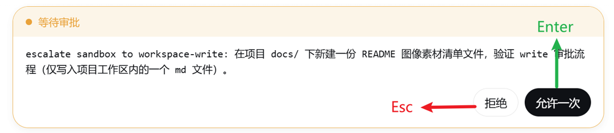
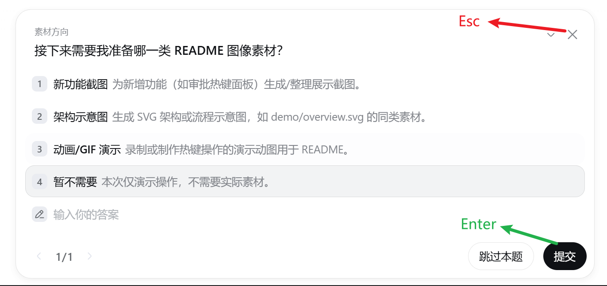
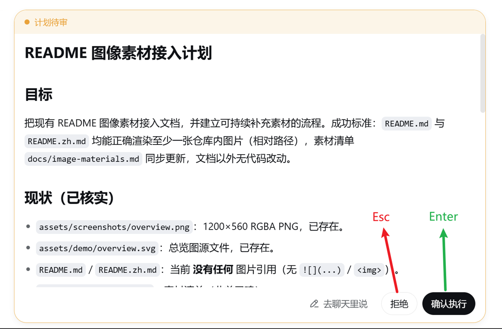

# dsh-approval-hotkeys

[](https://www.npmjs.com/package/dsh-approval-hotkeys)
[](https://github.com/SiriLee/dsh-approval-hotkeys/blob/main/LICENSE)

> [English](README.md) | 中文

[DeepSeek Harness](https://github.com/deepseek-ai/deepseek-harness) 的**审批面板快捷键**插件，
作用于**所有来源**的审批（不只编辑审批）。

刻意保持极简，一条通用规则：**Enter 总是按下确认按钮（primary 主色、动作行最右）；Esc 总是按下取消按钮**——
作用于 harness 渲染的每一类带按钮交互面板。这就是 Claude Code 的手感：Enter 确认，Esc 取消。

## ✨ 特性

| 特性 | 说明 |
| --- | --- |
| 覆盖一切交互面板 | 对 GUI 展示的**每个**带按钮面板生效——编辑审批、权限升级、工具提问、计划审查 |
| **Enter → 确认** | 按下动作行最右的 primary 按钮——「允许一次」/「提交/下一题」/「确认执行」 |
| **Esc → 取消** | 按下取消按钮——「拒绝」/「放弃整组」/「拒绝」 |
| 零配置 | 无设置页、无选项——一条通用规则、一个 effect |

面板锚点均为 harness 通用锚点，因此快捷键对 GUI 展示的**一切交互**生效——不只编辑审批。

| 面板 | Enter → 确认 | Esc → 取消 |
| --- | --- | --- |
| 审批 `[data-approval-key]` | 允许一次 | 拒绝 |
| 选择/提问 `[data-question-key]` | 提交/下一题 | 放弃整组 |
| 计划审查 `[data-plan-review-key]` | 确认执行 | 拒绝（无拒绝则去聊天） |

## 📸 截图

<table>
  <tr>
    <td align="center"><br><sub>审批面板 — Enter：允许一次，Esc：拒绝</sub></td>
    <td align="center"><br><sub>提问/选择面板 — Enter：提交，Esc：放弃整组</sub></td>
  </tr>
  <tr>
    <td align="center" colspan="2"><br><sub>计划审查面板 — Enter：确认执行，Esc：拒绝（无拒绝则去聊天）</sub></td>
  </tr>
</table>

## 📦 安装

```sh
dsh plugin --profile web add dsh-approval-hotkeys
```

重启 `dsh web`（或刷新页面——host 未变时刷新即加载新 client bundle）。无需任何配置。

## 原理

- **Enter → 确认**：点击面板的 primary 按钮——动作行最后一个按钮（「允许一次」/「提交/下一题」/
  「确认执行」）。harness 的 `Button` 组件没有稳定的 `data-variant` 属性（variant 只是 CSS
  Modules 的 hash class），因此插件锚定布局契约：**确认动作总是渲染在最后**——正是那个主色按钮。
- **Esc → 取消**：点击面板的取消按钮——审批=第一个（拒绝）、选择=header 最后（放弃整组）、
  计划审查=footer 倒数第二（拒绝；无拒绝按钮时退化为「去聊天」）。无面板时 Esc 不拦截
  （不做暂停/停止——那是 GUI「停止生成」按钮与既有快捷键的职责）。

### 守卫（刻意不做的事）

- **输入中不拦截**：焦点在 input / textarea / select / contentEditable 时交还输入框
  （`Enter` 发送、`Shift+Enter` 换行、`Esc` 收起联想都属于输入框）。
- **焦点在按钮上时 Enter 不拦截**：交给浏览器原生激活聚焦按钮、以及面板自身
  （选择弹窗的选项自带 Enter 提交）——再处理会双重触发。
- **组合键与连发不拦截**：`Ctrl/Meta/Alt+键` 与按住连发交给系统。
- **无面板时 Esc 不拦截**：插件只作用于交互面板，绝不停止/暂停 agent。

### 按钮解析契约（`data-hotkey="none"`）

Enter/Esc 解析按钮**按位置**（第一个 / 最后一个 / header 最后 / footer 最后），
而非稳定的语义属性——harness 的 `Button` 组件没有可靠的 `data-role` / `data-variant`，
对不拥有面板 DOM 的 client 插件而言，位置是唯一稳定信号，因此**按钮顺序是与 harness
布局唯一的耦合点**。

当**其他插件**向面板注入按钮（工具开关、装饰控件）时，为了让这个耦合保持安全，本插件
解析确认/取消按钮时会**跳过带 `data-hotkey="none"` 标记的按钮**。任何向交互面板添加
非操作按钮的插件，**应当**打上这个标记：

```html
<button data-hotkey="none">折叠 diff</button>
```

这是一个**协作式、opt-out 的契约，而不是硬保证**。它能可靠覆盖「插件在动作行前
额外插入一个非操作按钮」这一类（例如 dsh-edit-approval 的 diff 折叠按钮）；但**不**覆盖：

- 插件注入按钮却**不遵守标记**（契约被无视），或
- 插件在真正的确认/取消按钮之间**重排 / 插入可操作按钮**（语义变了，不只是加了装饰），或
- harness 自身改变面板布局。

这些情况需要在 harness 面板 DOM 上引入稳定的语义锚点（例如
`data-role="confirm"` / `data-role="cancel"`）——那是 harness 仓库的改动，不是
client 插件能解决的。真遇到时请向 deepseek-harness 提 issue / PR。

### 设计要点

- 纯浏览器（client）插件：host 半边是空桩；全部行为是注册在单个 `ctx.effect` 里的
  一个 `document` `keydown` 监听器，卸载/HMR 时解绑。
- 依赖稳定的 ApprovalPanel DOM 契约：拒绝在前、允许一次在后、回答后按钮 disabled——
  既不可能重复应答，按钮顺序也是与 harness 唯一的耦合点。
- 面板查找优先匹配当前会话的待审批 key，找不到再取 DOM 中第一个面板。

## 兼容性

- Node.js `^22.19.0 || >=24.0.0`。
- DeepSeek Harness web profile（`dsh --profile web`）；peer `@deepseek-ai/*` 包
  由 harness 在运行时解析。

> [!WARNING]
> 本项目与 DSH 均处于开发预览阶段。可复现环境中请固定精确版本，并审阅上文行为说明。

## 不含（Not included）

- **带 diff 预览的逐编辑审批** —— 由姊妹插件
  [dsh-edit-approval](https://github.com/SiriLee/dsh-edit-approval) 负责。
- **会话/工作区回退** —— 由姊妹插件
  [dsh-rewind](https://github.com/SiriLee/dsh-rewind) 负责。

本插件刻意保持单一定位：只管交互面板的快捷键。其余流程交由各自的专用插件。

## 开发

```sh
npm install
npm run typecheck   # tsc --noEmit（host + client）
npm test            # vitest（jsdom 单测，覆盖 dispatch 全部分支）
npm run build       # esbuild：lib/index.js + lib/client.js + .d.ts
node scripts/verify-host.mjs
```

`prepare` 运行全量构建，因此 git 安装与 `npm pack` / `npm publish` 总是产出完整的
`lib/`（含 `.d.ts`）与 `LICENSE`。

## 发布

首次发布需手动执行一次 `npm publish --access public`，之后由 GitHub Actions
**Trusted Publishing** 接管——推送 `v<semver>` 标签即自动带 provenance 发布。
完整步骤见 [docs/release.md](docs/release.md)。

## 安全

纯浏览器端插件：host 半面为空壳，全部行为是一个文档级 keydown 监听器，点击面板上已有的按钮。无网络请求、无文件访问、不接触任何凭据。

## 许可

[MIT](LICENSE)
